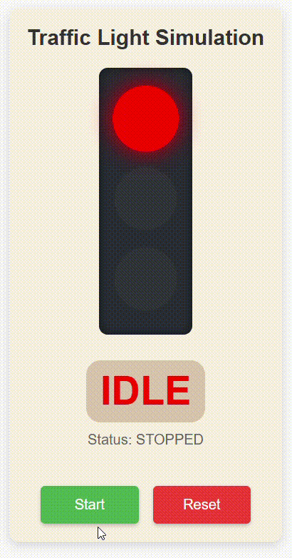

# Traffic Light Simulation
A simple traffic light UI built with React

## Documentation
Documentation of the program can be found **here**:
📄 [Simple Traffic Light Documentation (PDF)](./docs/simple-traffic-light-documentation.pdf)

## Requirement:
- NodeJs >= 18

## How to Run:
-> npm i
-> npm start

## Requirements
1. The light cycles in this order:
   * **Red → Green → Yellow → Red** (loop)
2. Time durations:
   * Red: 5 seconds
   * Green: 4 seconds
   * Yellow: 2 seconds
3. If the user **pauses**, the state freezes (including timer countdown).
4. On **reset**, return to Red and stop
5. Bonus: Use a **pure FSM model** (not just `setTimeout` chaining).
6. Optional: Include a way to test edge cases like rapid pause/start or skipping frames (e.g. use `requestAnimationFrame` or simulate lag).

## Evaluation Criteria:

* **FSM Design**: Clear state model (`currentState`, `transitions`, etc.).
* **Separation of Concerns**: State logic is not tightly coupled with UI rendering.
* **Timer Management**: Proper timer cleanup, pauses, and resuming.
* **Scalability**: Adding new states (e.g., pedestrian light) should be easy.
* **Code Clarity**: Clean code, proper abstractions, and comments.
